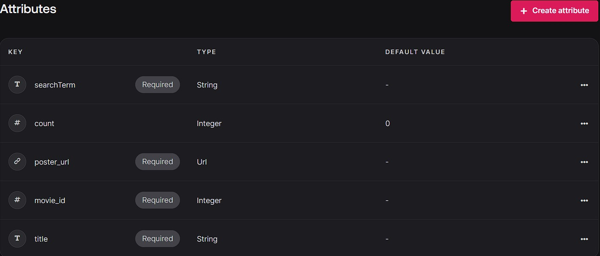
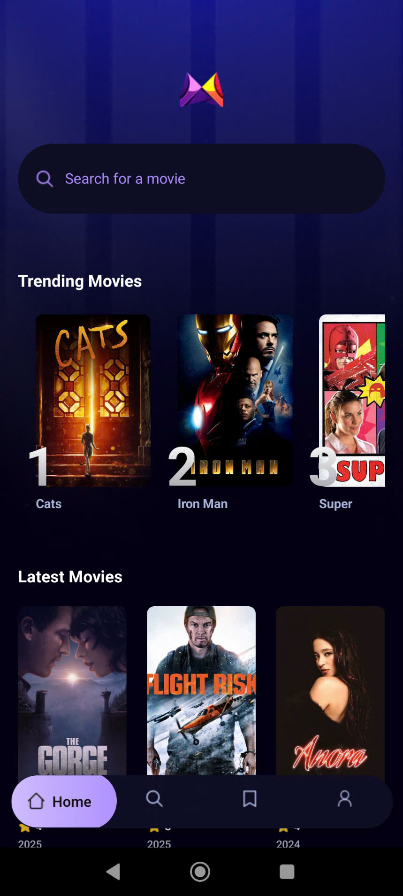
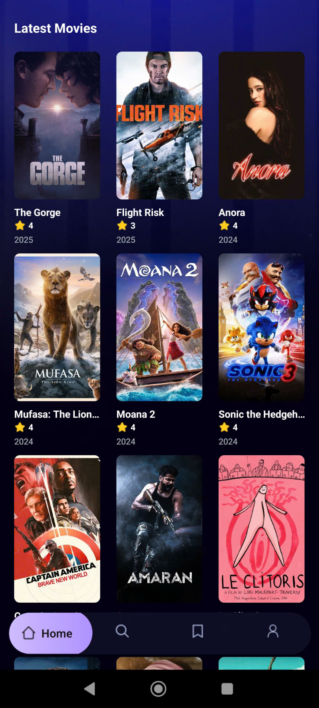
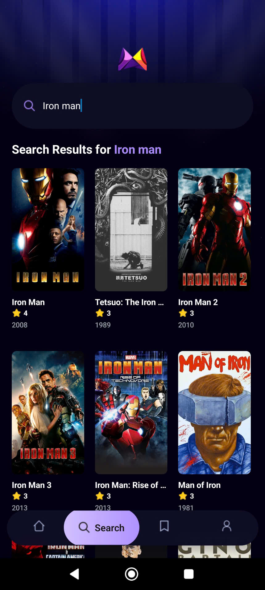
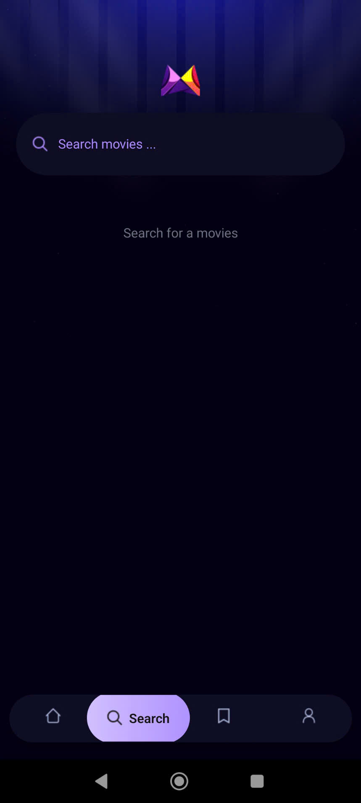
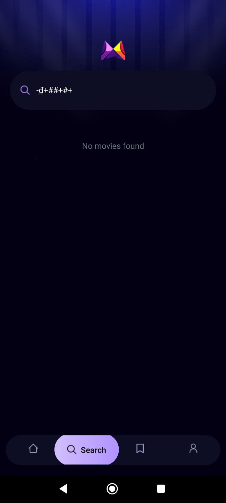
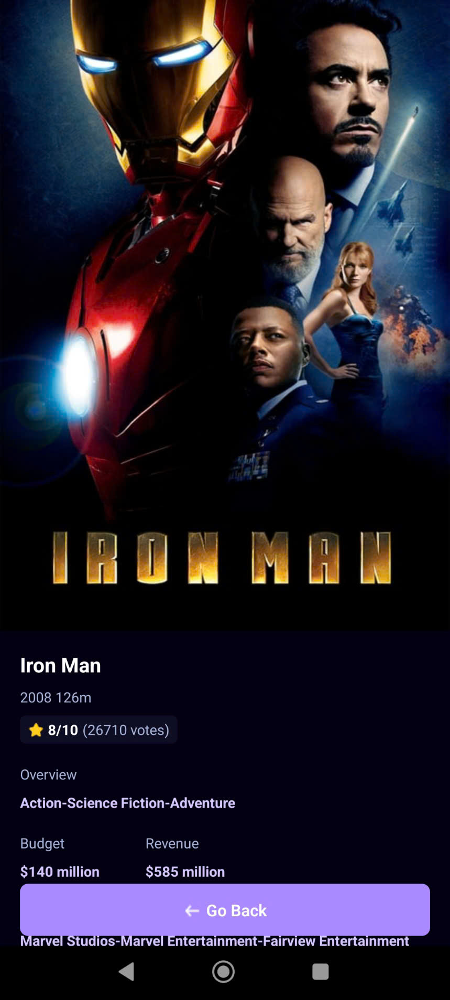

<div align="center">
  <div>
    
    
    
    
    
  </div>

  <h3 align="center">A Movie Finding App with Extensive Search</h3>
</div>

## 📋 <a name="table">Table of Contents</a>

1. 🤖 [Introduction](#introduction)

2. ⚙️ [Tech Stack](#tech-stack)

3. 🔋 [Features](#features)

4. 🤸 [Quick Start](#quick-start)

5. 📱 [Preview App](#preview)

## <a name="introduction">🤖 Introduction</a>

Built with Expo, TypeScript, and Tailwind CSS, this app fetches movies and creates a popularity algorithm using Appwrite. It provides users with a seamless browsing experience, ranking movies based on various engagement metrics. The app leverages modern UI/UX principles for a responsive and visually appealing interface, ensuring real-world scalability and performance.

## <a name="tech-stack">⚙️ Tech Stack</a>

- Expo

- React Native

- Appwrite

- TypeScript

- Tailwind CSS

### Features of the Mobile Movie AppProject

👉 **Real-time data**: Fetching and displaying real-time movie data

👉 **Home Page**: Featured and discover movies

👉 **Search Page**: Search for your favorite movies

👉 **Popularity algorithm**: Track user searches to display the most popular movies

(etc)

and many more, including code architecture and reusability.

## <a name="quick-start">🤸 Quick Start</a>

Follow these steps to set up the project locally on your machine.

**Prerequisites**

Make sure you have the following installed on your machine:

- [Git](https://git-scm.com/)

- [Node.js](https://nodejs.org/en)

- [npm](https://www.npmjs.com/) (Node Package Manager)

**Cloning the Repository**

```bash


```

**Installation**

Install the project dependencies using npm:

```bash

npm install

```

**Set Up Environment Variables**

Create a new file named `.env` in the root of your project and add the following content:

```env

EXPO_PUBLIC_MOVIE_API_KEY=

EXPO_PUBLIC_APPWRITE_PROJECT_ID=

EXPO_PUBLIC_APPWRITE_DATABASE_ID=

EXPO_PUBLIC_APPWRITE_COLLECTION_ID=


```

Replace the placeholder values with your actual TMDB API key, Appwrite project ID, Database ID, and Collection ID. You can obtain these credentials by signing up on the [Appwrite](https://cloud.appwrite.io/console/login), [TMDB](https://www.themoviedb.org/login).

**Set Up Appwrite**

1. Create database movies and copy database_id
2. Create collection metrics and copy collection_id
3. Create attributes according to the image below

   

**Running the Project**

```bash

npx expo start

```

Open your ExpoGO app on your phone and scan the QR code to view the project.

## <a name="preview">📱 Preview App</a>

<div align="center" style="display: flex; flex-wrap: wrap; gap: 10px; justify-content: center;">
    
    
    
    
    
    
</div>
